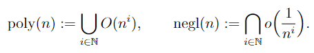
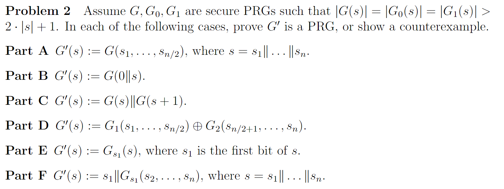

# 2_PRG

$$\newcommand{\c}[1]{\mathcal{#1}}\newcommand{\Gen}{\textsf{Gen}}\newcommand{\Rand}{\textsf{Rand}}\newcommand{\Enc}{\textsf{Enc}}\newcommand{\Dec}{\textsf{Dec}}\newcommand{\Sign}{\textsf{Sign}}\newcommand{\Eval}{\textsf{Eval}}\newcommand{\poly}{\textrm{poly}}\newcommand{\negl}{\textrm{negl}}\newcommand{\bit}{\{0,1\}}\newcommand{\gl}{\textsf{gl}}\newcommand{\hc}{\textsf{hc}}\newcommand{\getsr}{\stackrel{\smash{\$}}\gets}$$

## PsuedoRandom Generator

一个确定性函数$G:\{0,1\}^n\to \{0,1\}^{\ell(n)}$是PRG，如果：

- $G$可在多项式时间内求出；
- $\forall n, \ell(n)>n$；
- 对任意的PPT（非确定性、多项式时间可计算）distinguisher $D:\{0,1\}^*\to\{0,1\}$，存在函数$\varepsilon(n)=\mathrm{negl}(n)$，使得对于任意$n$有
$$\left|\Pr_{s\getsr\{0,1\}^n}[D(G(s))=1]-\Pr_{r\getsr\{0,1\}^{\ell(n)}}[D(r)=1]\right|\le \varepsilon(n)$$

> 注意：此时$D$可以任意的调用$G$。

$\mathrm{negl}(n)$是小于任何多项式-1次方的函数

用PRG构建一个One-Time Pad，可以实现Computational secrecy：对于任意PPT distinguisher $D$，和两个明文$m_0,m_1$，$D$无法在区分$c_0,c_1$上取的大于negl的advantage：

$$\forall D,\forall m_0,m_1\in\c{M},\left|\Pr_{k\leftarrow\Gen\atop c_0\leftarrow \Enc(k,m_0)}[D(c_0)\to 0]-\Pr_{k\leftarrow\Gen\atop c_1\leftarrow \Enc(k,m_1)}[D(c_1)\to 0]\right|\le\\mathrm{negl}(n)$$

很难知道PRG是否存在，所以之后的一切讨论都建立在存在一个PRG的基础上。假设$\ell(n)=n+1$的PRG存在，可以构造出$\ell(n)=2n$的PRG。如图。

为了证明无法在多项式时间内用$D$分出$G'$与完全随机（不能有$>\mathrm{negl}$的advantage），构造$n$个hybrid，其中$G'=hybrid-0$，之后每个hybrid从上一个去掉最后一层，输出倒数第二层，以及随机一个字符补上最后一层的最后一位。可以发现$hybrid-n$就是完全随机了。根据$G$为PRG，任取PPT $D$，任取$G'$一层，$D$无法区分出这一层与完全随机。于是$G'$与$hybrid-1$无法区分，同样方法可知任意两个相邻hybrid无法区分，进而$G'$与随机无法区分。（无法区分指的是advantage小于$\mathrm{negl}$，所以这条线并不能无限传递，可以传递$n$次的原因是任何$\mathrm{poly}(n)\cdot \mathrm{negl}(n)=\mathrm{negl}(n)$）用这个方法可以构造$\ell(n)=\mathrm{poly}(n)$的任何PRG。

证明一个函数是/不是PRG的方法：

- 构造hybrid（比较直观，方便口胡）
- 反设它不是PRG，用$D$构造出$D'$推出它的组件也不是PRG
- 取一个合法的组件（另一个PRG的函数），然后构造$D$

