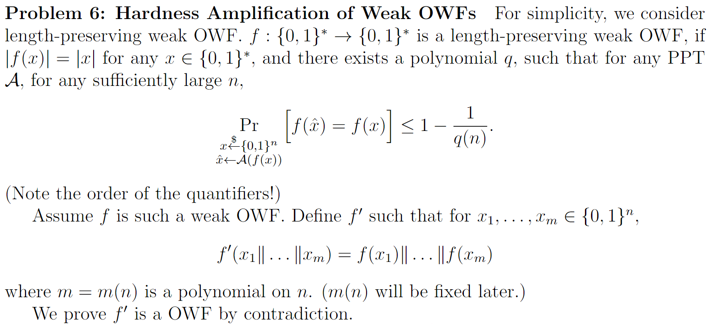
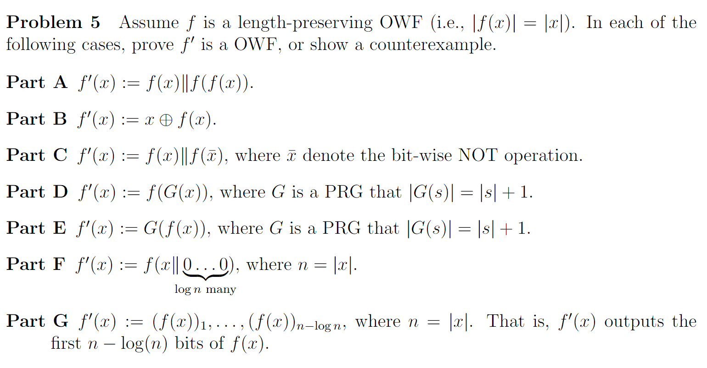
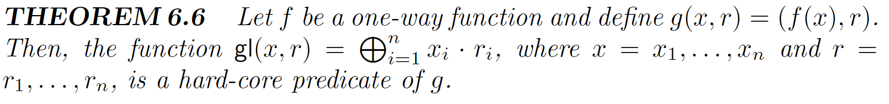

# 3_OWF

$$\newcommand{\c}[1]{\mathcal{#1}}\newcommand{\Gen}{\textsf{Gen}}\newcommand{\Rand}{\textsf{Rand}}\newcommand{\Enc}{\textsf{Enc}}\newcommand{\Dec}{\textsf{Dec}}\newcommand{\Sign}{\textsf{Sign}}\newcommand{\Eval}{\textsf{Eval}}\newcommand{\poly}{\textrm{poly}}\newcommand{\negl}{\textrm{negl}}\newcommand{\bit}{\{0,1\}}\newcommand{\gl}{\textsf{gl}}\newcommand{\hc}{\textsf{hc}}\newcommand{\getsr}{\stackrel{\smash{\$}}\gets}$$

## One-Way Function

一个确定性函数$f:\{0,1\}^*\to \{0,1\}^*$是OWF，如果：

- $f$可在多项式时间内求出（Easy to compute）；
- $f$难以求逆（Hard to invert）：对任意的PPT inverter $\c{A}$，存在函数$\varepsilon(n)=\mathrm{negl}(n)$，使得
$$\Pr_{x\leftarrow\{0,1\}^n}[f(\c{A}(f(x)))=f(x)]\le \varepsilon(n)$$
（注意这里不是$\c{A}(f(x))=x$）

> PRG是OWF。

如果$f$是PRG且不是OWF, 由$f$不是OWF，存在$\mathcal{A}$ 使得

$$\Pr_{s\in\bit^n}[f(\mathcal{A}(f(x)))=f(x)]>\negl(n)$$

构造distinguisher$\mathcal{D}(s)=[f(\mathcal{A}(s))=s]$即可。

证明：用$\mathcal{F}=\{f(x)|x\in\bit^n\}$ 表示 $f$的像。

$$\begin{aligned}
	\Pr_{s\getsr\bit^{\ell(n)}}[\mathcal{D}(s)=1]
	&=\frac{|\mathcal{F}|}{2^{\ell(n)}}\Pr_{s\getsr\bit^{\ell(n)}}[\mathcal{D}(s)=1,s\in \mathcal{F}]
	+(1-\frac{|\mathcal{F}|}{2^{\ell(n)}})\Pr_{s\getsr\bit^{\ell(n)}}[\mathcal{D}(s)=1,s\notin \mathcal{F}]\\
	&\le\frac{2^n}{2^{\ell(n)}}\Pr_{s\getsr\bit^{\ell(n)}}[\mathcal{D}(s)=1,s\in \mathcal{F}]\\
	&\le\frac{2^n}{2^{\ell(n)}}\Pr_{x\getsr\bit^{n}}[\mathcal{D}(f(x))=1]\\
\end{aligned}
$$

注意到由定义 $\Pr_{x\getsr\bit^{n}}[\mathcal{D}(f(x))=1]=\Pr_{s\in\bit^n}[f(\mathcal{A}(f(x)))=f(x)]\ge \negl(n)$，于是有

$$
\left|\Pr_{s\getsr\bit^{\ell(n)}}[\mathcal{D}(s)=1]-\Pr_{x\getsr\bit^{n}}[\mathcal{D}(f(x))=1]\right|\ge (1-\frac{2^n}{2^{\ell(n)}})\negl(n)\ge \frac 12\negl(n)
$$

说明$\c{D}$是一个distinguisher，$f$不是PRG。
			

### Weak OWF

将$\varepsilon(n)$改为$1-\frac{1}{\mathrm{poly}(n)}$。

有Weak OWF就可以构造出OWF。

### Length-Regular OWF

对于任意$|x_1|=|x_2|$，$|f(x_1)|=|f(x_2)|$。

如果存在OWF，一定存在$p(\cdot)$使得对于所有$x$，有$|f(x)|\le p(|x|)$。加上一个padding，令$f'(x)=f(x)10^{p(|x|)-|f(x)|}$，即可构造出一个Length-Regular OWF。

### Length-Preserving OWF

对于任意$x$，$|f(x)|=|x|$。

利用Length-Regular OWF，也可以构造一个Length-Preserving OWF。注意到，如果有一个L-P OWF $f(\cdot)$，如果有一个super-log多项式$q(n)=\omega(\log n)$，可以构造一个函数$f'(x)=f(x_{1\dots q(n)})$，它只用上了输入的$q(n)$位，但它还是一个OWF，因为$2^{-q(n)}$还是negligible的。（这对于PRG也适用。）

对于L-P OWF，有$\ell(|x|)=f(|x|)$。取$q(\cdot)$使得$q(\ell(|x|))<|x|$，然后加上padding即可。由于$\ell$是多项式，这样的$q$存在。

证明一个函数是/不是OWF的方法与PRG类似。

## Hard-core Predicate

对于函数$f$，一个函数$\hc:\{0,1\}^*\to \{0,1\}$是它的一个hard-core，如果：

- $\hc$可在多项式时间内求出（Easy to compute）；
- 对于任意的PPT算法$\c{A}$，有
$$\Pr_{x\leftarrow\{0,1\}^n}[\c{A}(f(x))=\hc(x)]\le \frac 12+\mathrm{negl}(n)$$

如果$f$有hard-core，可以理解为它至少有这一个bit的信息不会泄露。

> 任何OWF都有一个hard-core。

证明：假设$\gl(x,r)$不是hard-core，存在一个PPT算法$\c{A}$使得

$$\Pr_{x\leftarrow\{0,1\}^n}[\c{A}(f(x))=\gl(x)]\ge \frac 12+\frac{1}{\mathrm{poly}(n)}$$

我们尝试构造PPT inverter$\c{A}'$。如果$\forall i$，$\c{A}'$能以$1-\frac{1}{ \poly(n)}$以上的概率得到$x$的第$i$位，那么多运行几次就可以得到$x$。我们现在尝试得到第一位。

若$x$满足$\Pr[\c{A}(f(x))=\gl(x)]\ge \frac{1}{2}+\frac{1}{\mathrm{poly}(n)}$则说它是好的。任取$x$，它是好的概率$\ge \frac{1}{\mathrm{poly}(n)}$，否则$\c{A}'$无法invert。

令$k=\log n$，随机生成$r_1,r_2,\dots,r_k\getsr\bit^n$，并猜测$\{g_i=\gl(x,r_i)\}_{i=1}^k$，猜对概率为$\frac 1n$。固定$x$，如果$x$是好的，且$g_i$全对（有$\ge \frac{1}{\poly(n)}$的概率达到）：

$\forall S\ne \varnothing,S\subseteq\{1,2,\dots,k\},$调用$\c{A}'(f(x),\left(\bigoplus_{j\in S}r_j\right)\oplus 1\underbrace{000\dots0}_{n-1})$。它有$\ge \frac{1}{2}+\frac{1}{\mathrm{poly}(n)}$的概率返回正确。假设返回正确，返回值应该是$\left(\bigoplus_{j\in S}g_j\right)\oplus x_1$，于是可以得到$x_1$。

约有$n$个这样的集合，猜了$n$个$x_1$（而且是相互独立的），取出现次数较大的作为$x_1$返回。由Chernoff bound，猜对$>\frac{2}{n}$次的概率$\ge \frac{1}{2}+\frac{1}{\mathrm{poly}(n)}$，所以$f$可以成功被invert，不是OWF。

### One-Way Permutation

顾名思义，如果一个OWF $f(x)$是length-preserve的且是一个permutation（双射），则$f(x)$是一个OWP。

若$f(x)$是OWP，$\hc(x)$是$f(x)$的一个hard-core，则$g(x)=f(x)||hc(x)$是PRG。