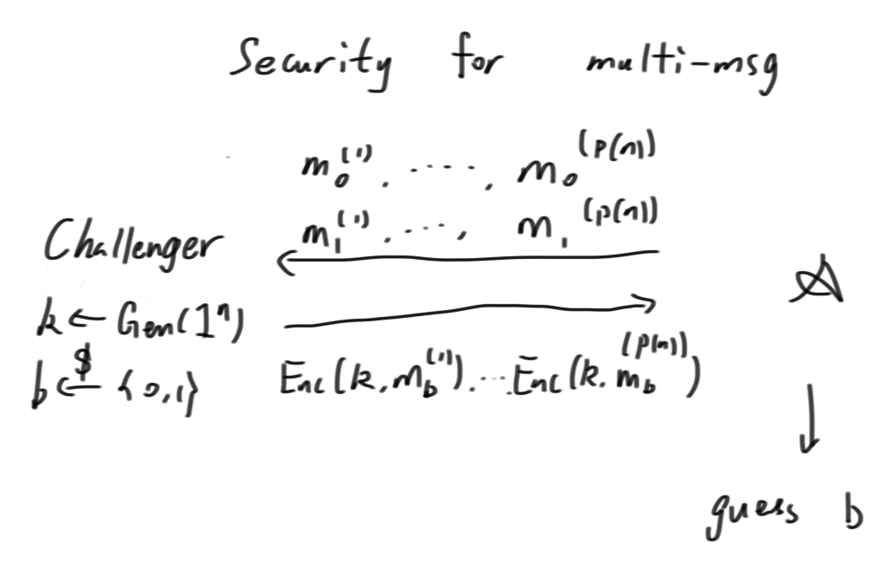
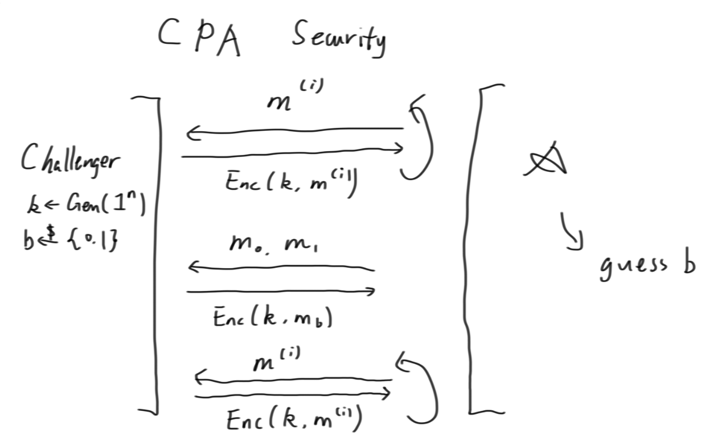
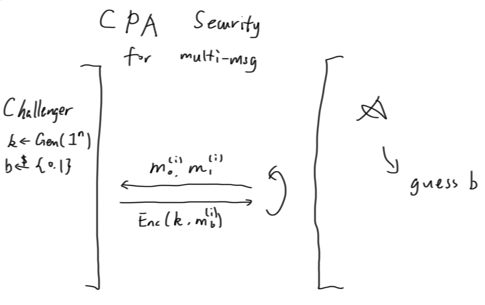
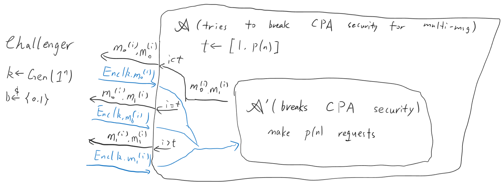
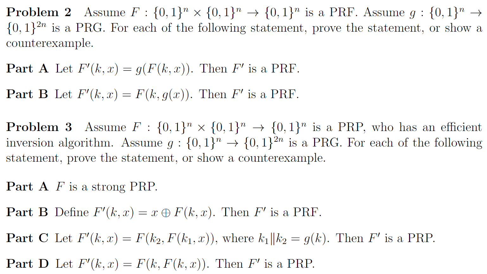

# 4_PRF_CPA

$$\newcommand{\c}[1]{\mathcal{#1}}\newcommand{\Gen}{\textsf{Gen}}\newcommand{\Rand}{\textsf{Rand}}\newcommand{\Enc}{\textsf{Enc}}\newcommand{\Dec}{\textsf{Dec}}\newcommand{\Sign}{\textsf{Sign}}\newcommand{\Eval}{\textsf{Eval}}\newcommand{\poly}{\textrm{poly}}\newcommand{\negl}{\textrm{negl}}\newcommand{\bit}{\{0,1\}}\newcommand{\gl}{\textsf{gl}}\newcommand{\hc}{\textsf{hc}}\newcommand{\getsr}{\stackrel{\smash{\$}}\gets}$$
如果生成了一个长度为指数级的串$s,|s|=2^n$，每次加密时随机一个位置$p$，然后以$s[p\dots p+n-1]$为密钥$k$，发送密文$c=\Enc(p,m)=\left(p,\Enc_{inner}(s[p\dots p+n-1],m)\right)$，那么攻击者因为不知道$s[p\dots p+n-1]$的值，很难通过$p$的值发起攻击。

然而显然不存在$\ell(n)=2^n$的PRG，因为按照定义只需枚举就可以破解，而实际上提前生成指数级的串也没有意义。但是注意到只需要$s$中连续的一段，考虑这样一种构造，首先有一个$\ell(n)=2n$的PRG$G(x)\overset{\mathrm{def}}{=}G_0(x)||G_1(x) \ (|G_0(x)|=|G_1(x)|=n)$。构造$S_l(k,x)\ (l=|k|)$

$$\begin{aligned}
S_1(a,x)&=G_a(x)\\
S_{l+1}(a||k,x)&=G_a(S_l(k,x))\\
\end{aligned}$$

以类似二叉树构造出了$s$。这样的话取一个子串就不需要指数级了。这个例子用PRG构造了一个PRF。

## PsuedoRandom Function

一个确定性函数$f:\{0,1\}^n\times \{0,1\}^n\to \{0,1\}^{n}$是PRF，如果：

- $f$可在多项式时间内求出；
- 对任意的PPT distinguisher $D$，存在函数$\varepsilon(n)=\mathrm{negl}(n)$，使得：当函数$f':\{0,1\}^n\to \{0,1\}^{n}$从所有可行函数中随机取时，

$$\left|\Pr_{k\getsr\{0,1\}^n}[D^{f_k(\cdot)}(1^n)=1]-\Pr_{f'\getsr (\{0,1\}^n\to \{0,1\}^{n})}[D^{f'(\cdot)}(1^n)=1]\right|\le \varepsilon(n)$$

其中$D^{f(\cdot)}(1^n)$类似一个程序，传入$1^n$让$D$知道串长（且保证复杂度），它有$\poly(n)$次询问的机会，每次可以得到一个$f(x)$的值。且$D$可以是适应性的(adaptive)，即可以在得到答案后再决定下一个询问。

## CPA Security

现实中对手可以影响到明文的值，所以这里认为对手可以选择明文，让安全性进一步加强。

下面是几个安全性的定义，都以和Adversary的游戏过程定义。

### Security for multi-message

- 随机生成密钥$k\getsr \Gen(1^n)$；
- $\c{A}$选定$p(n)=\poly(n)$，然后生成两组明文$m_0^{(1)},m_0^{(2)},\dots,m_0^{(p(n))},m_1^{(1)},m_1^{(2)},\dots,m_1^{(p(n))}$；
- 随机生成$b\getsr\bit$，加密得到$\Enc(k,m_b^{(1)}),\Enc(k,m_b^{(2)}),\dots,\Enc(k,m_b^{(p(n))})$，并给$\c{A}$；
- $\c{A}$通过密文在多项式时间内猜$b$的值，如果猜对则对手胜利。

如果对手胜利的概率$\le \frac12+\negl(n)$，则该加密是安全的。（显然还需要存在正确的$\Dec$，且$\Enc,\Dec$都多项式时间可计算）

显然对手可以设置$m_0^{(1)}=m_0^{(2)},m_1^{(1)}\ne m_1^{(2)}$，再看看输出是否相同就行了。为了让加密过程安全，$\Enc$函数可以做以下两种改进：随机性或内置状态。

### Chosen Plaintext Attack Security

- 随机生成密钥$k\getsr \Gen(1^n),b\getsr\bit$；
- $\c{A}$可以询问若干次，每次$\c{A}$给出$m$，并得到$\Enc(k,m)$；
- 在任意时刻，$\c{A}$可以做一次特殊的询问，给出$m_0,m_1$，并得到$\Enc(k,m_b)$。
- $\c{A}$在多项式时间内（这意味着询问次数不超过多项式）猜出$b$的值，如果猜对则对手胜利。

### Chosen Plaintext Attack Security for multi-message

- 随机生成密钥$k\getsr \Gen(1^n),b\getsr\bit$；
- $\c{A}$可以询问若干次，每次给出$m_0,m_1$，并得到$\Enc(k,m_b)$。
- $\c{A}$在多项式时间内（这意味着询问次数不超过多项式）猜出$b$的值，如果猜对则对手胜利。
- 

### 安全性的比较
    
显然，Chosen Plaintext Attack Security for multi-message是安全性最高的。但可以证明Chosen Plaintext Attack Security安全性与它一样高，即，如果能破译CPA，一定能破译CPA for multi-message。Adversary的构造如下：

证明正确性的核心在于，首先看$t=1,b=1$和$t=p(n),b=0$两种情况，这时$\c{A}'$都输入了正确的东西。再考虑$t=t_0,b=0$和$t=t_0+1,b=1$两种情况，这时$\c{A}'$输入的东西都一样，那么输出也一样，但标准答案正好有一半的概率是0，所以这部分不会取得任何的advantage，最后就是$\frac{1}{p(n)}$乘以前两种情况的advantage，而由于$\c{A}'$成功破破译了CPA的安全性，advantage是non-negl的。

## PRG/OWF/PRF/PRP

### Pseudorandom Permutation

只要$f_k(x)$都是排列即可。

### Strong PRP

又叫“Block Cipher”，在PRP的基础上要求：
- 高效的求逆算法存在:$f_k^{-1}$可快速计算；
- 让$\c{D}$也拥有$f_k^{-1}$和$f^{-1}$的调用权限，也无法区分$f$和随机排列。

> 存在PRP不是Strong PRP。

假设存在Strong PRP$F':\bit^n\times\bit^n\to\bit^n$。

定义
$$F_k(x)=\begin{cases}0, &x=k\\
				F'_k(k), &x=F'^{-1}_k(0)\\
				F'_k(x), &\text{otherwise}
				\end{cases}$$
				
可以证明，$F_k(x)$是PRP。但显然，如果$f=F_k$，询问$f^{-1}(0)$就可以知道$k$了，所以它不是Strong PRP。

