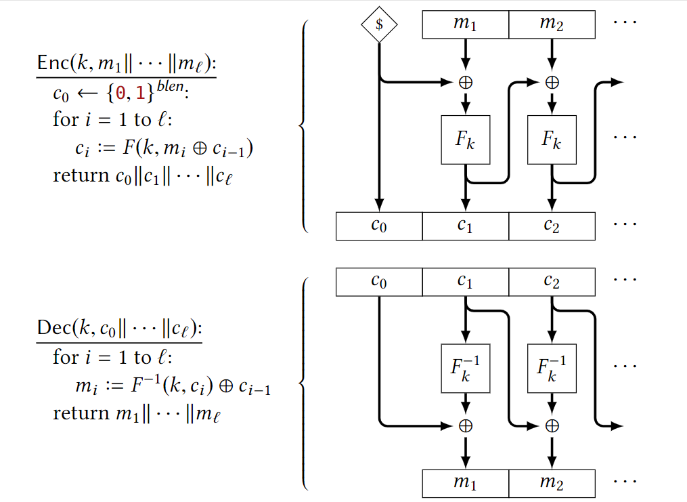
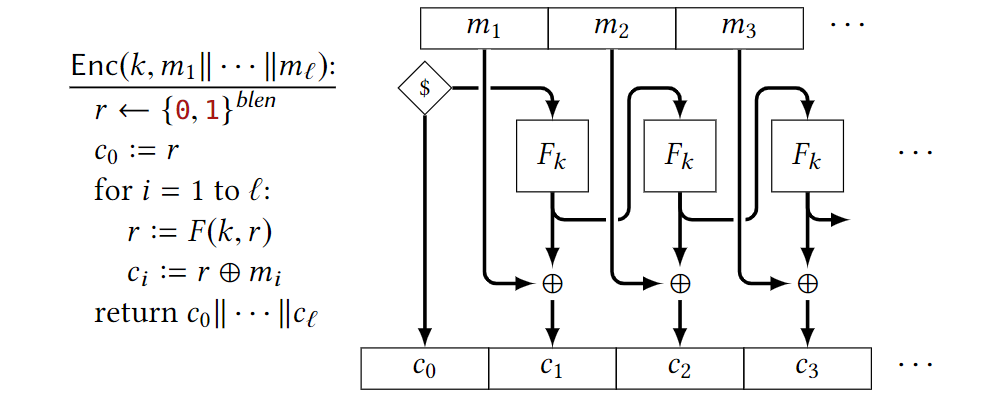
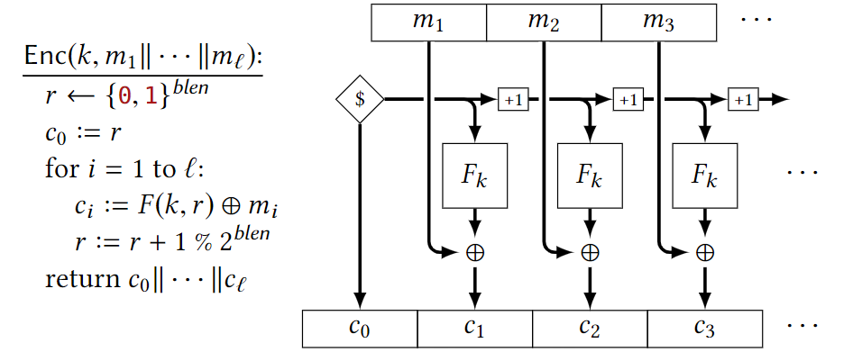
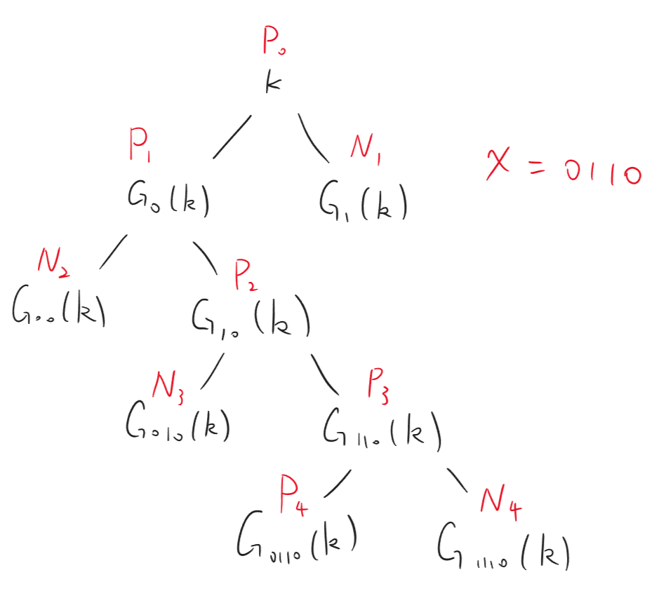

# 5_Feistel_Modes_AES
$$\newcommand{\c}[1]{\mathcal{#1}}\newcommand{\Gen}{\textsf{Gen}}\newcommand{\Rand}{\textsf{Rand}}\newcommand{\Enc}{\textsf{Enc}}\newcommand{\Dec}{\textsf{Dec}}\newcommand{\Sign}{\textsf{Sign}}\newcommand{\Eval}{\textsf{Eval}}\newcommand{\poly}{\textrm{poly}}\newcommand{\negl}{\textrm{negl}}\newcommand{\bit}{\{0,1\}}\newcommand{\gl}{\textsf{gl}}\newcommand{\hc}{\textsf{hc}}\newcommand{\getsr}{\stackrel{\smash{\$}}\gets}$$
## Feistel Network

Feistel网络是一种用PRF构造PRP的方法。它的构造使得求逆变得很简单，且增加层数会让安全性更高。

假设$F$是一个PRF，$k_1,k_2,\dots,k_r$是密钥。 Feistel及逆的构造如下：

$r$轮的Feistel网络称为r-round Feistel。输入为$(v_0,v_1)$，输出为$(v_r,v_r+1)$。

> 2-round Feistel不是PRP。

因为给$v_0$异或上一个值，$v_2$一定被异或同样的值。

> 3-round Feistel是PRP，但不是Strong PRP。

假设distinguisher $\c{D}$第$i$次询问的$v_k$是$v_k^i$，且$(v_0^i,v_1^i)$互不相等。

先证$v_2^i$大概率不等。如果$v_1^i=v_1^j$说明$v_0^i\ne v_0^j\Rightarrow v_2^i\ne v_2^j$；否则，需要说明$\c{D}$没有在之前的输入中获取关于$F(k_1,v_1^*)$的任何信息（即：$\c{D}$询问$q=\poly(n)$次后，给他$F(k_1,v_1^q)$或随机串，它无法区分），即可说明$v_2^i$大概率（1-negl）互不相等。

假设$\c{D}$能区分$F(k_1,v_1^q)$或随机串，那么将输入异或$v_0$，也能区分$v_2^q$和随机串。注意$\c{D}$知道$v_4^q=v_2^q\oplus F(k_3,v_3^q)$。再将输入异或$v_4^q$，就能区分$F(k_3,v_3^q)$和随机串了！这说明$F(k_3,\cdot)$ is distinguishable from random function.（为什么不能直接构造distinguisher区分$F(k_1,\cdot)$呢？因为只有$\mathbb{F}_3$和$F(k_1,\cdot)$无法将$\mathbb{F}_3$中的$F(k_1)$替换。）

现在证明了$v_2^i$大概率不等，那么$\c{D}$是无法得到任何关于$F(k_2,v_2)$的信息的。接下来证明就不难了。

为什么不是Strong PRP呢？考虑如下构造：

构造$\c{D}^{f(\cdot),f^{-1}(\cdot)}$ 以区分$\mathbb{F}_3$ 与随机排列。它做如下操作：
-  sample $v_0,v_1,x\getsr\bit^n$;
- get $v_3,v_4=f(v_0,v_1)$;
- get $v'_0,v'_1=f^{-1}(v_3,v_4\oplus x)$;
- get $v'_3,v'_4=f(v'_0\oplus x,v'_1)$;
- return if $v_1\oplus v_3=v'_1\oplus v'_3$.

> 4-round Feistel是Strong PRP。

待填坑

## Modes of Encryption

以下是几种CPA安全的加密方法（以PRP/PRF为基础，任意长度）

### CBC(Cipher Block Chain) Mode

### OFB(Output-Feedback) Mode

### CTR(Counter) Mode

### Revocable broadcast encryption

构造一个punctuable PRF：利用length-doubling PRG $G(x)$以及$G_0(x)||G_1(x)=G(x)$构造如下二叉树：

将puncture key设为$x,\{N_n\}$即可。懒得证了

### Advanced Encryption Standard

反正不考，懒得写了