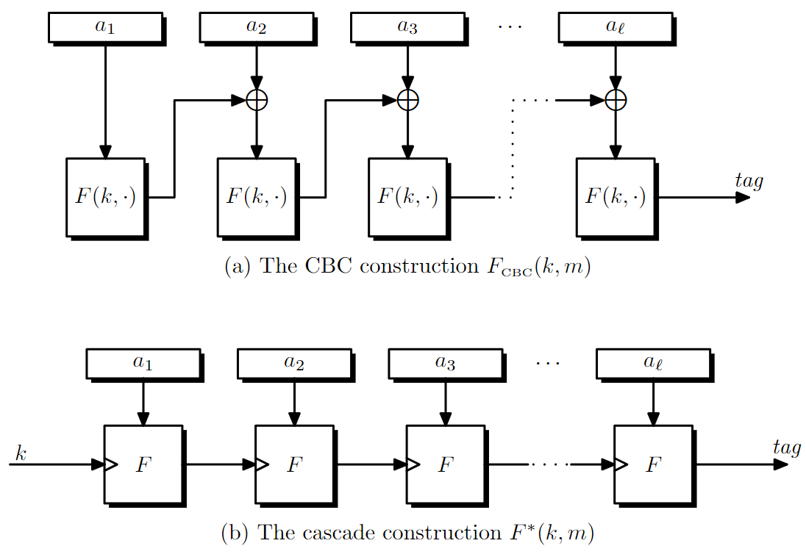
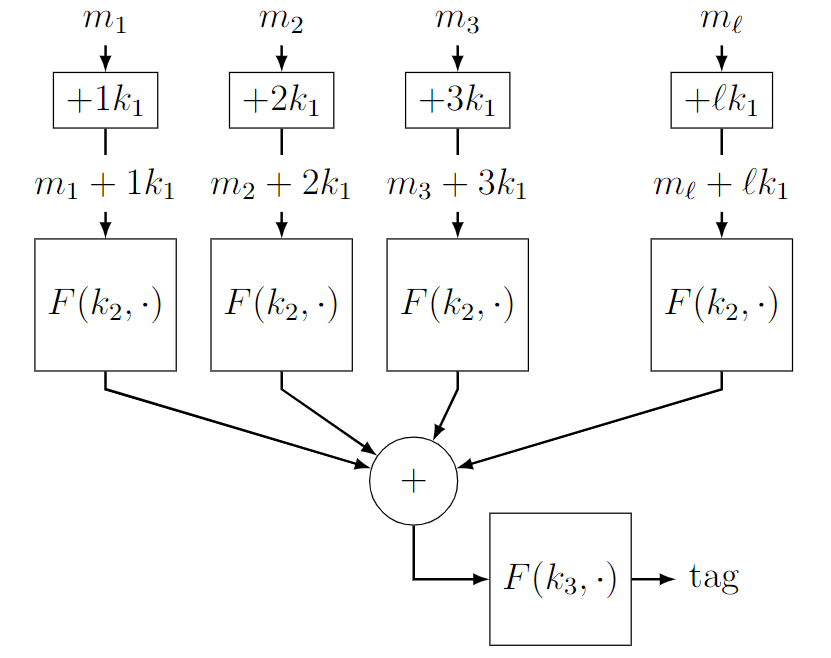

# 6_CCA_Auth

$$\newcommand{\c}[1]{\mathcal{#1}}\newcommand{\Gen}{\textsf{Gen}}\newcommand{\Rand}{\textsf{Rand}}\newcommand{\Enc}{\textsf{Enc}}\newcommand{\Dec}{\textsf{Dec}}\newcommand{\MAC}{\textsf{MAC}}\newcommand{\verify}{\textsf{Vrfy}}\newcommand{\Sign}{\textsf{Sign}}\newcommand{\Eval}{\textsf{Eval}}\newcommand{\poly}{\textrm{poly}}\newcommand{\negl}{\textrm{negl}}\newcommand{\bit}{\{0,1\}}\newcommand{\gl}{\textsf{gl}}\newcommand{\hc}{\textsf{hc}}\newcommand{\getsr}{\stackrel{\smash{\$}}\gets}$$

## Chosen Ciphertext Attack

### 引入

考虑Alice和Bob在通信，攻击者可以加密任意信息和窃听，然而因为加密方法是CPA安全的，攻击者得不到什么有用的信息。

假设加密的方法是CBC，即明文异或上某种One-Time Pad。由于得分块加密，需要在信息最后加一些Padding。有一种可能的Padding设计：信息最后加若干0，最后一位是前面0的数量。

现在攻击者窃听到了一条合法（Padding格式正确）的信息，并获得了新能力：假装Alice给Bob发信息，然后得到该信息是否合法。那么攻击者可以先得到Padding的长度，然后通过一些修改得到信息最后一位的值。

### 定义

考虑poly-time的两方$\c{C}$和$\c{D}$之间的如下游戏：

- $\c{C}$随机生成$k\getsr\bit^n$；
- $\c{D}$得到$1^n$，并可以进行任意次询问$\Enc_k(\cdot),\Dec_k(\cdot)$；
- $\c{D}$给出两个长度相等的$m_0,m_1$，$\c{C}$随机选择$b\getsr\bit$并将$c\leftarrow\Enc_k(m_b)$发给$\c{D}$；
- $\c{D}$可以继续询问$\Enc_k(\cdot),\Dec_k(\cdot)$，但不能询问刚才得到密文的解码值；
- $\c{D}$输出$b'$，如果$b=b'$则$\c{D}$获胜。

如果$\c{D}$获胜概率$\le \frac 12+\negl(n)$，则加密过程是CCA安全的。

## Message Authentication Code

为了应对CCA攻击，可以想到一种方法：让攻击者生成的密文全部被拒绝就可以了。如果没有key，就无法生成一个合法的密文。

### 定义

MAC由$(\Gen, \MAC, \verify)$三个部分组成。$\Gen$用于生成key，$\MAC(k,m)\to t$用于生成数字签名，$\verify$用于检查是否正确，一般来说$\verify(k,m,t)=[\MAC(k,m)=t]$。

考虑poly-time的两方$\c{C}$和$\c{D}$之间的如下游戏：

- $\c{C}$生成$k\getsr\Gen(1^n)$；
- $\c{D}$得到$1^n$，可以询问若干次，设第$i$次给出$m_i$，$\c{C}$将$t_i\leftarrow \MAC(k,m_i)$发给$\c{D}$。
- $\c{D}$给出$m,t$发给$\c{C}$。需要满足
    1. $m\ne m_i, \forall i$
    2. $(m,t)\ne (m_i,t_i), \forall i$
- 如果$\verify(k,m,t)=1$，则$\c{D}$获胜。

如果$\c{D}$获胜概率$\le \negl(n)$，则这个MAC是secure(unforgeable)的。

如果给出的$m,t$只需满足2，称它是strongly secure的。

注意这个定义中，$\c{D}$不能调用$\verify$。可以证明，如果使用确定性MAC且使用canonical verification（$\verify(k,m,t)=[\MAC(k,m)=t]$），$\c{D}$是否能调用$\verify$是一样的。

否则，可以操作$\verify$让它透露key的一些内容，导致调用$\verify$会变得不安全。（见exercise 4.3）

现在只考虑strong的情况。假设MAC是确定性的，否则，MAC需要阻止对手在已知一个信息的若干tag后生成新的tag，这样做似乎没有必要。

## Authentic Encryption

有一个CPA-secure的encryption scheme $(\Enc_k, \Dec_k, \Gen_1)$，以及strongly secure的MAC $(\Gen_2, \MAC, \verify)$

现在尝试构造CCA-secure。考虑以下三种构造方式，明文为$m$，密文为$c'$：

### encrypt-and-MAC

$$c=\Enc_{k_1}(m), t=\MAC_{k_2}(m), c'=(c,t)$$

注意$\MAC(m)$中可能完全包含$m$的值，如：$\MAC(m)=m||\MAC'(m)$。$t$中可能直接包含明文信息。

### MAC-then-encrypt

$$t=\MAC_{k_2}(m), c=\Enc_{k_1}((m,t)), c'=c$$

这个方法也完全没有保护$m$。假如$\Enc$不CCA安全，这个方法也不会CCA安全。

### encrypt-then-MAC

$$c=\Enc_{k_1}(m), t=\MAC_{k_2}(c), c'=(c,t)$$

这个方法是CCA安全的，且更强。对手甚至不能让他生成的信息合法。

## Fixed-Length MAC

### Build MAC from PRF

如果一个PRF的output space是super-poly的，那么它显然是MAC。

### Prefix-Free PRFs for long messages

下面是两种由较短PRF构造更长PRF的方法：

如果$\ell$固定，它们都是PRF。但如果$\ell$不固定，以(a)为例，可以先通过一次查询得到$F(k,a_1)$，然后令$a_2=F(k,a_1)\oplus a_1$，返回应该也是$F(k,a_1)$，找到了一种区分的方法。可以证明，如果任意两个查询不互为前后缀，这两个PRF的构造方式是合法的。称为Prefix-Free PRF。

(a)证明要点：建立一棵树，证明在每一次询问之后，树上任意两条边$F_{CBC}(k,(x_1,x_2,\dots,x_{a-1}))\oplus x_a\ne F_{CBC}(k,(y_1,y_2,\dots,y_{b-1}))\oplus y_b$以大概率成立。这说明上次询问中，对于任何已询问串，adversary没有得到任何$F_{CBC}(k,\cdot)$作用于该串任何真前缀的信息。（无法和随机区分）

#### Prefix-Free Encoding

$E:\bit^*\to\bit^*$是prefix-free encoding 如果：

- $E$可多项式时间计算；
- 存在高效的解码算法$D$；
- 对于任意$x\ne x'$，$E(x)$不是$E(x')$的前缀。

$E(x)=0^{|x|}1x$是一个prefix-free encoding；
$E(x)=0^{||x||}1|x|x$是一个prefix-free encoding，长度是$|x|+O(\log |x|)$。
以此类推，令$a_0=x,a_{i+1}=|a_i|,s=\min\{i\mid |a_i|=10\}$。（不考虑一开始长为1的情况）$E(x)=\mathrm{concat}(0^{s}1,a_{s-1},a_{s-2},\dots,a_0)$是一个prefix-free encoding，额外长度不太多，看起来比较优。

> 不存在prefix-free encoding使得$E(x)=|x|+o(\log|x|)$。

对于块大小$n$，可以证明存在对于长度$<2^n$的所有串，有一个$n| \mathrm{len}(E(x)),\mathrm{len}(E(x))\le |x|+2n$的prefix-free coding，把它套到上面的PRF即可获得一个MAC。

### Parallel MAC

如果$F$是PRF，则$F_{PMAC}((k_1,k_2,k_3),(m_1,m_2,\dots, m_{\ell}))$是一个secure PRF（不需要Prefix-free）。优点是支持并行计算。

证明要点：先证明对于任意两个$m+ik$，在$k$随机时，它们相等的概率很低；对于adversary的两个不同的询问，找到一个$F(k_2,m_j+ik_1)$只在一边出现，故adversary无法通过操作$m$来操作$\sum_{i=1}^{\ell_j}(k_2,m_{j,i}+ik_1)$；所以$F(k_3,\cdot)$的输入近乎随机sample的多项式个值，相等的概率很低。
