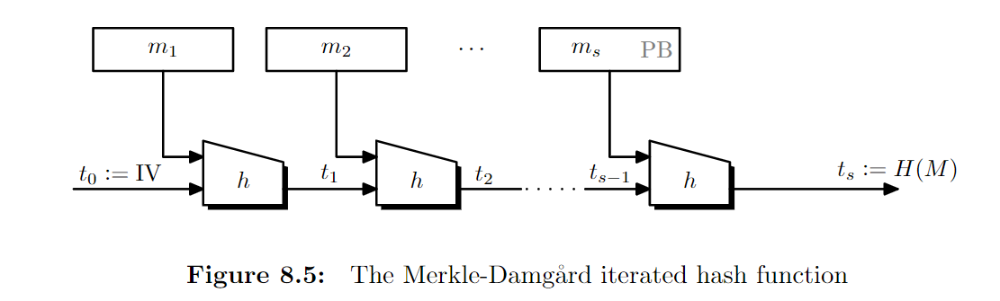
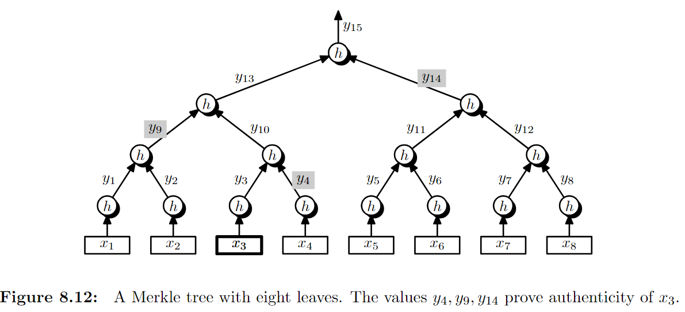

# 7_Hash_Extractor_CRHF

$$\newcommand{\c}[1]{\mathcal{#1}}\newcommand{\Gen}{\textsf{Gen}}\newcommand{\Rand}{\textsf{Rand}}\newcommand{\Enc}{\textsf{Enc}}\newcommand{\Dec}{\textsf{Dec}}\newcommand{\MAC}{\textsf{MAC}}\newcommand{\verify}{\textsf{Vrfy}}\newcommand{\Sign}{\textsf{Sign}}\newcommand{\Eval}{\textsf{Eval}}\newcommand{\poly}{\textrm{poly}}\newcommand{\negl}{\textrm{negl}}\newcommand{\bit}{\{0,1\}}\newcommand{\gl}{\textsf{gl}}\newcommand{\hc}{\textsf{hc}}\newcommand{\getsr}{\stackrel{\smash{\$}}\gets}\newcommand{\Hmin}{H_{\textsf{min}}}\newcommand{\collprob}{\textsf{CollProb}}$$

## Hash Function

### Pairwise independent (strongly universal) hash function

现在有key space,message space, tag space $(\c{K},\c{M},\c{T})$，如果$H:\c{M}\to\c{T}$是一个确定性算法，且对于任意$m\ne m'\in\c{M}$，有

$$\Pr_{k_1,k_2\getsr\c{K}}[H(k_1,m),H(k_2,m')]=\frac1{|\c{K}|^2}$$

即任选两个明文，它们hash值的分布是均匀的。则$H$是一个strongly universal hash function。

#### universal hash function

只需

$$\Pr_{k\getsr\c{K}}[H(k,m)=H(k,m')]=\frac{1}{2^n}$$

即很难在只知道算法不知道key的情况下用多项式个明文构造哈希冲突。

#### ε-universal hash function

将上面的$\frac{1}{2^n}$改为$\varepsilon(n)$即可。

#### computational universal hash function

对于任何PPT adversary，将$1^n$发给它表示key/msg/ciphertext的长度。它输出$x_1,x_2$。如果$H(k,x_1)=H(k,x_2)$则adversary获胜。如果$H$使得任何adversary的获胜概率都$\le \negl(n)$，则它是computational universal hash function。

通过Hash可以让MAC支持更长的输入。如果$H(k,m)$是computational universal hash function，$F$是PRF，则$F(k_2,H(k_1,m))$是安全的MAC。

## Randomness Extractor

在缺少随机来源的情况下，可能有一些Weak Random Source，即分布可能不是均匀随机。Extractor是一个确定性函数（因为它就要造随机函数），想输出一个uniform的串。

假设$X$是random source，有$m$位，它的熵有$\ell\le m$位。还有一个$s$位均匀随机的输入$S$，称为seed。想要用它们输出其它$n$位uniform/close to uniform的串。有$n\le \ell$。具体来说，需要$S||E(S,X)$的分布close to $\bit^{s+n}$的均匀分布（统计距离是negligible的）。

### min-entropy

我们发现，很多情况下，这样的extractor根本不存在，尽管$m$有足够的熵。例：$X$有一半概率全0，一半概率在非全0串中随机。这样的话，$X$全0时不管映射到哪个值都会破坏均匀性，因为概率太大了。

若$\forall x\in\c{X},\Pr[X=x]\le 2^{-m}$，则称$X$有$m$ bit的最小熵。即，每个$x$都最多有$2^{-m}$概率取到。即：

$$\Hmin[X]=-\log \max_{x\in\c{X}}\Pr[X=x]$$

### [Rényi_entropy](https://en.wikipedia.org/wiki/Rényi_entropy)

这里我们使用

$$H_2[x]=-\log\sum_{x\in\c{X}}\Pr[X=x]^2$$

log后即独立从该分布中选两变量的碰撞概率。

对于同一个随机变量，$\Hmin[x]\le H_2[x]\le H[x]$。

### Universal Hash Function is a Random Extractor.

这里假设$X$满足$H_2[X]=\ell$，即$\collprob[X]=2^{-l}$。

考虑一个分布与均匀分布的统计距离。

$$\begin{aligned}
SD&=\sum_{p\in\bit^{s+n}}\left|\Pr[(S||E(S,X))=p]-2^{-(s+n)}\right|\\
&=\sqrt{\sum_{p\in\bit^{s+n}}\left(\Pr[(S||E(S,X))=p]-2^{-(s+n)}\right)^2}\\
&\le\sqrt{\sum_{p\in\bit^{s+n}}\Pr[(S||E(S,X))=p]^2-2^{-(s+n)}}\\
&=\sqrt{\collprob[S||E(S,X)]-2^{-(s+n)}}
\end{aligned}$$

考虑计算Collision Probability 

$$\begin{aligned}
\collprob[S||E(S,X)]&=\Pr_{S,S',X,X'\text{ are random}}[S=S';E(S,X)=E(S',X')]\\
&=2^{-s}\Pr_{S,X,X'\text{ are random}}[E(S,X)=E(S,X')]\\
&=2^{-s}\left(\Pr_{X,X'\text{ are random}}[X=X']+\Pr_{S,X,X'\text{ are random}}[E(S,X)=E(S,X')|X\ne X']\Pr_{X,X'\text{ are random}}[X\ne X']\right)\\
&\le 2^{-s}\left(2^{-\ell}+2^{-n}\right)\\
&=2^{-(s+n)}\left(2^{-(\ell-n)}+1\right)\\
SD&\le \sqrt{\collprob[S||E(S,X)]-2^{-(s+n)}}\\
&\le \sqrt{2^{-(s+n)}2^{-(\ell-n)}}\\
&=2^{-\frac{s+\ell}2}
\end{aligned}$$

注：证明中没有用到$s$是因为$E$是universal hash function用到了$s$，如果$s$太小没有办法universal。

$E$用一个$s$位的种子和一个$m$位的弱输出了$s+n$个（接近）随机的位，成功多提取了$n$位。

## CRHF (Collision-Resistant Hash Function)

$h:\bit^{xn}\to \bit^n$是一个函数，对于任意PPT Adversary $\c{A}$

- $\c{A}$得到$1^n$；
- $\c{A}$输出$x_0\ne x_1$；
- $\c{A}$获胜，如果$h(x_0)=h(x_1)$。

如果$\c{A}$获胜概率$\le \negl(n)$，则$h$是一个CRHF。

注意，这是一个keyless的函数，所以这个定义非常强。

### 构造任意长度的CRHF

假设$h:\bit^{2n}\to \bit^n$是一个CRHF，想构造一个任意长度（$n$倍数）的CRHF。

考虑一种Merkle–Damgård construction 

$$h_{MD}(m_1,\dots,m_k)=\begin{cases}h(h_{MD}(m_1,\dots,m_{k-1}),m_k),&k>1\\h(IV,m_1)&k=1\end{cases}$$

其中IV（Initial Vector）是一个固定值。

PB（Padding Block）加在原串最后，包含关于原串长度的信息以避免前缀攻击。

可以证明，若能找到$h_{MD}$的冲突，一定能找到$h$的冲突。假设$h$是CRHF，则$h_{MD}$是CRHF。

如果$H$是CRHF，$\MAC(k,m)$是定长MAC，则$\MAC(k,H(m))$也是的MAC。

### Merkle tree

假设我们有很多（$2^k$个）群聊，$x_1,\dots,x_{2^k}$存着每个群聊的成员名单和聊天记录（当然它们都被封了，所以不会变）。Alice是一名王晶，每次想询问一个群聊的所有信息。Alice收到之后，想要verify他收到的数据是否被修改过。假设存在CRHF $h:\bit^{2n}\to \bit^n$，构造如下完全二叉树（线段树）

我们可以在$O(2^k)$时间内算出整棵树的hash值（$y_{15}$）并将其发给Alice。如果Alice想要查$x_3$的值，我们把$x_3$和它到树根的路径上沿途的hash发给Alice，然后可以验证是否得出$y_{15}$。由于$h$是一个CRHF，我们很难伪造沿途路径上的hash值。

这种方法不需要发送很多信息，且每次只会泄露需要的那一块的信息。由于这是线段树，甚至可能可以支持其他操作（单点修改？？）

